# LinkPulse

**A URL shortener with real-time analytics.** I built it the way you'd answer the "design bit.ly" system-design interview question, and then shipped it.

[](https://github.com/naniiic137/linkpulse/actions/workflows/ci.yml)


The redirect path does one cache lookup and returns a 302. It never waits on the database or on analytics. Clicks go into a Redis Stream, and a background writer saves them to PostgreSQL in batches. Unique visitors are counted with HyperLogLog, and every endpoint that needs it is rate limited with an atomic sliding window in Redis. The whole backend also has an in-memory implementation behind the same interfaces, so `npm run dev` and all tests work without Docker. CI runs the same suite against real PostgreSQL 16 and Redis 7.

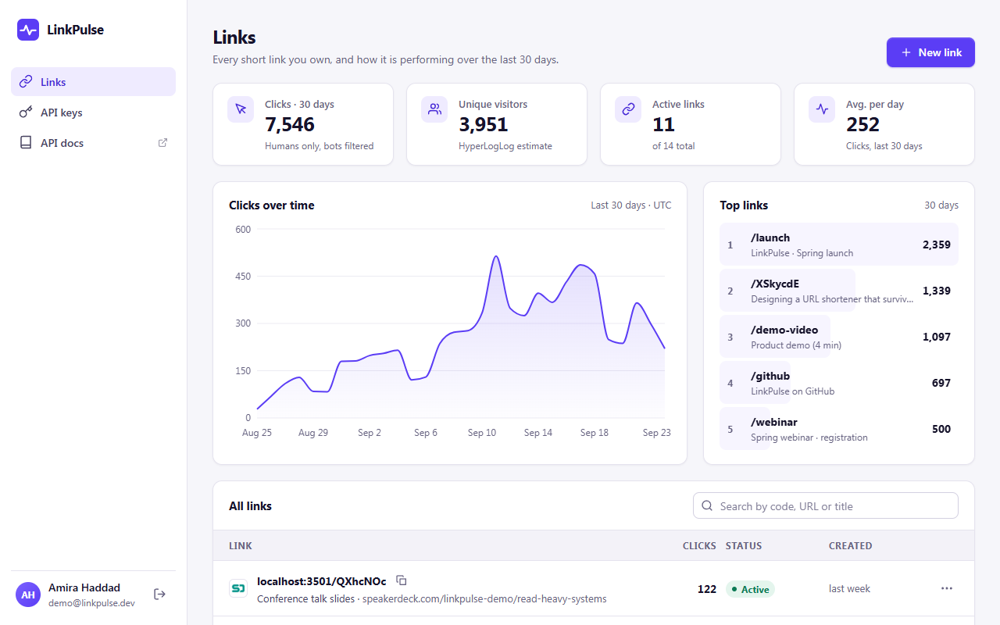

| Per-link analytics | Create a link: short URL + QR |
| --- | --- |
| 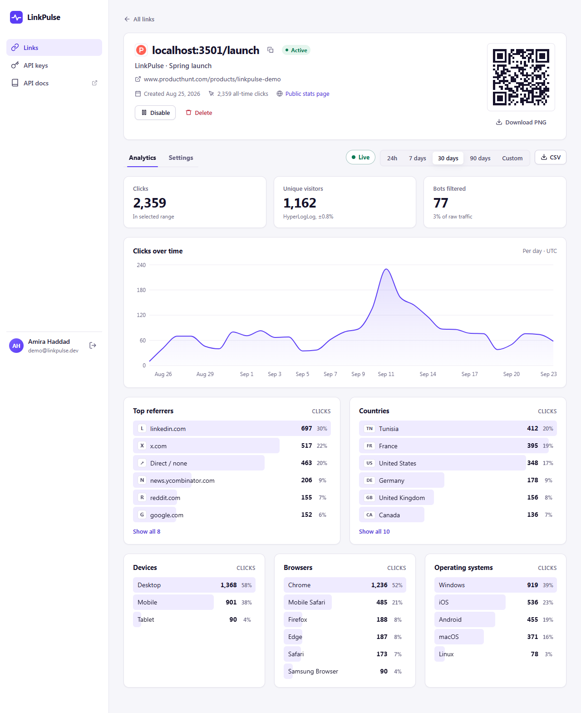 | 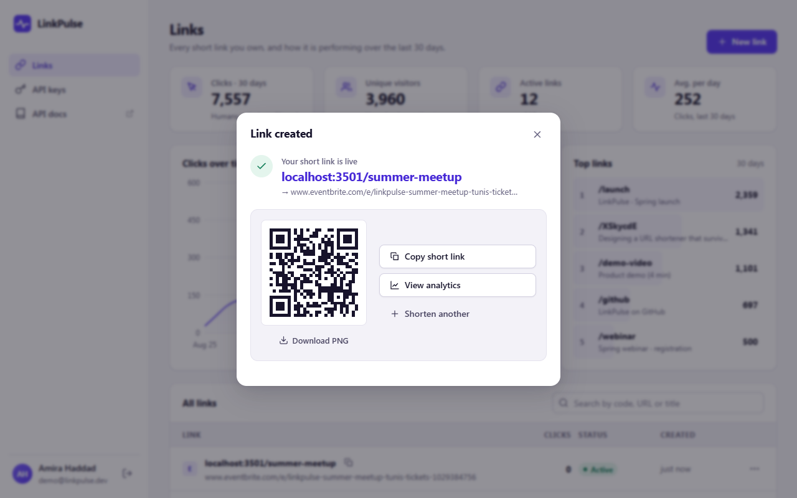 |
| **Rate limited: 429 banner with a live Retry-After countdown** | **Public stats page (opt-in per link)** |
| 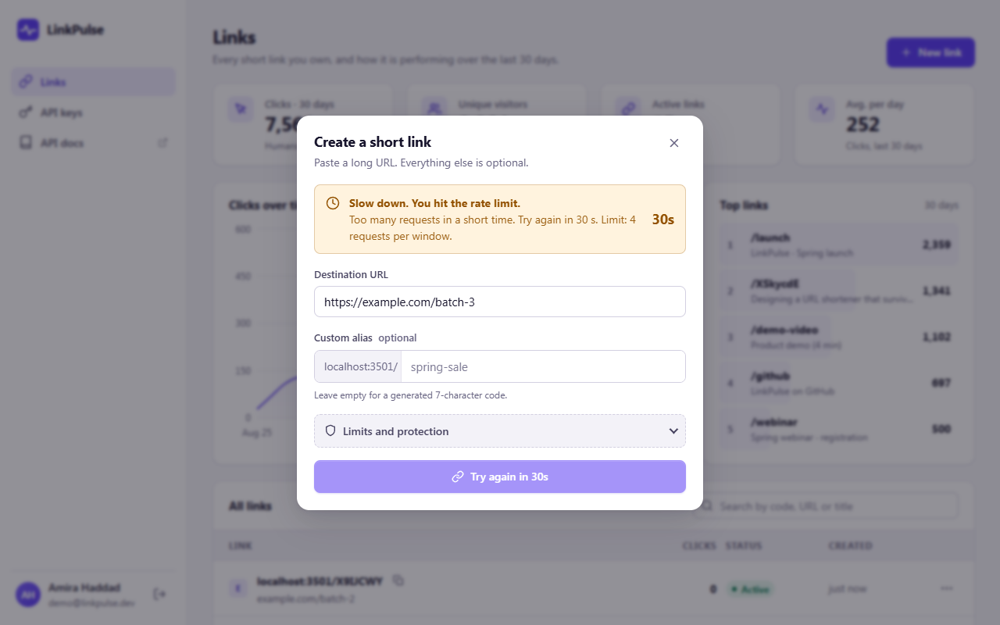 |  |

<details>
<summary>More screenshots: link list, create form, API keys, mobile</summary>

| Link list | Create form |
| --- | --- |
| 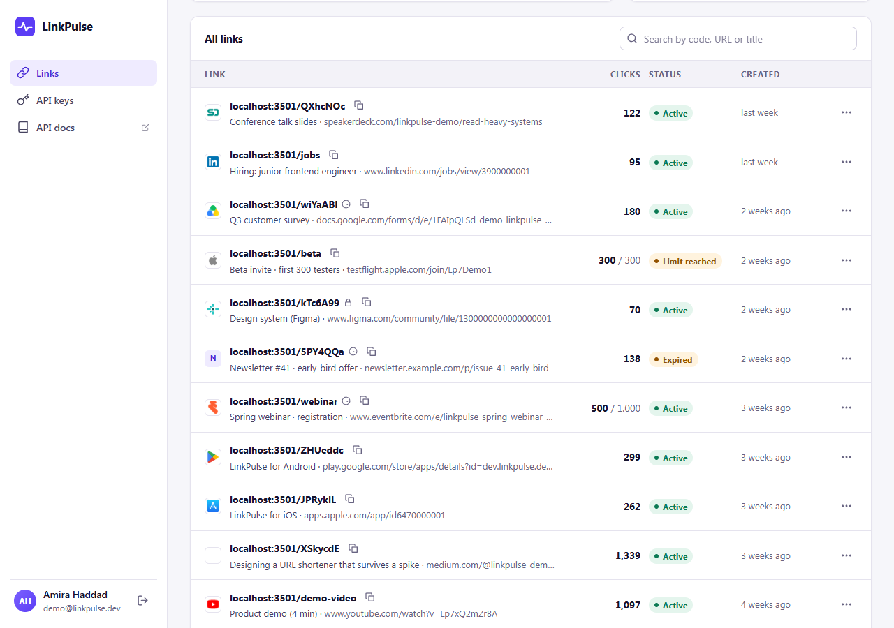 | 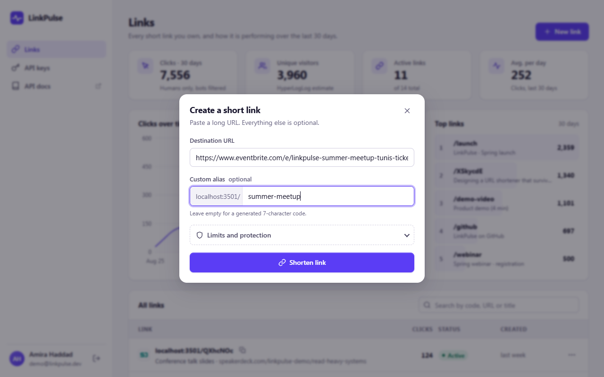 |
| **API keys** | **Mobile (390 px)** |
| 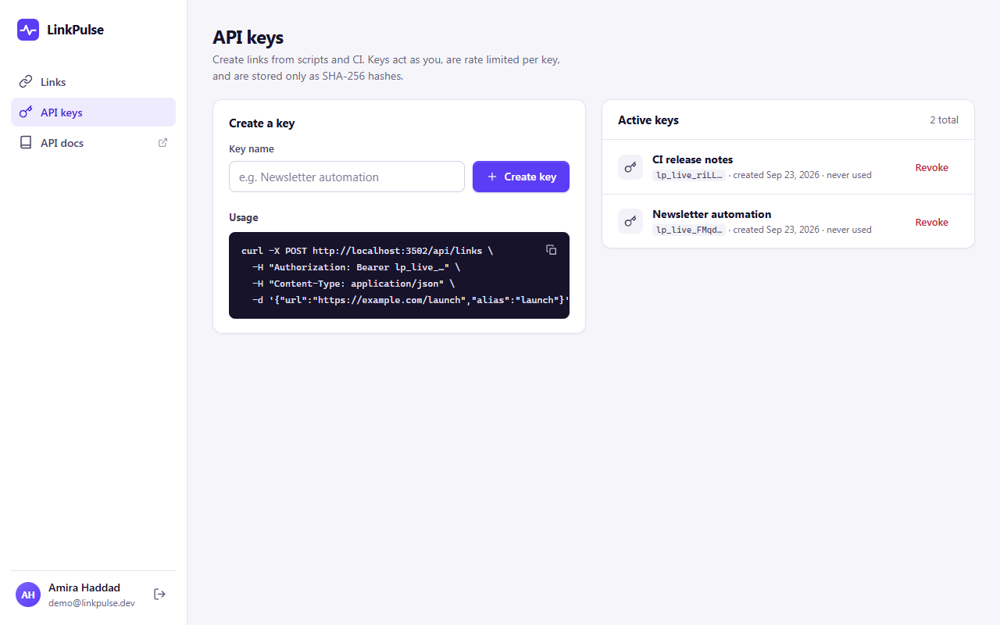 | 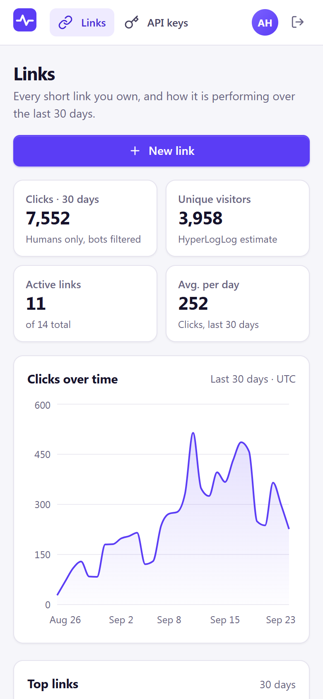 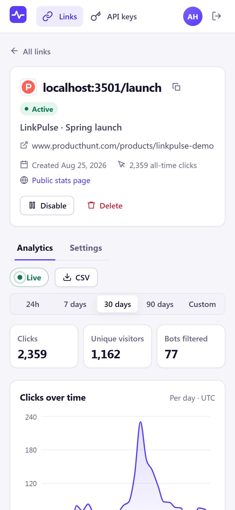 |

</details>

All data in the screenshots is fictional seed data. It is generated from a fixed random seed.

---

## Features

**Short links**
- 7-character base62 codes. They come from a counter passed through a keyed permutation, so they are collision-free by construction ([why](#id-generation-trade-offs)).
- Custom aliases (validated; reserved words like `api`, `docs`, `login` and `stats` are refused).
- Optional expiry date, optional max clicks, and optional password (Argon2id-hashed).
- Enable/disable, edit destination, delete. Every change invalidates the cached entry right away.
- URL safety: http(s) only (`javascript:`, `data:`, `file:` and others are refused). No embedded credentials. No private, loopback, link-local or metadata IPs, including tricks like `http://2130706433/` and `[::ffff:127.0.0.1]`. No links back to the shortener itself (redirect loops). There is also a domain blocklist.
- QR code for every link: SVG or PNG from the API, rendered client-side in the dashboard, no CDN.
- Link preview (title + favicon), fetched in the background with SSRF protections: the IP check runs inside the socket's DNS lookup, so it blocks DNS rebinding. Also enforced: ports 80/443 only, every redirect hop re-validated, a 3 s timeout, and a 256 KB cap.

**Redirects**
- `GET /:code` returns 302. It returns 301 with `REDIRECT_STATUS=301`, but 301s are cached by browsers and so hide repeat clicks from analytics.
- Cache-aside in Redis with TTL + jitter, plus negative caching of unknown codes. PostgreSQL is the source of truth.
- Clicks are queued fire-and-forget. The redirect handler never awaits analytics.
- Browsers get small HTML pages for 404, 410 (disabled, expired or limit reached), 429 and the password prompt. API clients get JSON.

**Analytics**
- Total and unique clicks (HyperLogLog), clicks over time (hourly or daily buckets, zero-filled), top referrers, countries, devices, browsers and OS.
- Bot filtering: crawlers and link unfurlers (Slackbot, etc.) are redirected but not counted. They also don't consume a link's max-clicks quota.
- Date-range filter (24 h / 7 d / 30 d / 90 d / custom), CSV export with formula-injection escaping, and a live counter over Server-Sent Events.
- Country comes from an edge header: `CF-IPCountry` (Cloudflare), or `X-Country` set by your own proxy; configurable with `COUNTRY_HEADER`. No GeoIP database, and raw IPs are never stored (visitors are an HMAC of IP + UA with a server-side salt).

**Platform**
- Accounts with Argon2id passwords and JWT sessions in an httpOnly, SameSite=Lax cookie. Cookie-authenticated writes also need an `X-Requested-With` header as a CSRF guard.
- API keys (`lp_live_…`): shown once, stored as SHA-256, rate limited per key, and revocable.
- Per-user ownership isolation. Other users' links answer **404**, not 403, so ids can't be probed.
- Rate limiting per IP (redirects, sign-in, link creation) and per user or API key. Limited responses carry `RateLimit-Limit/Remaining/Reset/Policy`, and 429s add `Retry-After`.
- OpenAPI 3 + Swagger UI at `/docs`, `/health` (liveness) and `/ready` (readiness: DB + Redis, 503 while draining), structured JSON logs (pino, request ids, secrets redacted), and graceful shutdown that drains the click queue.

---

## Architecture

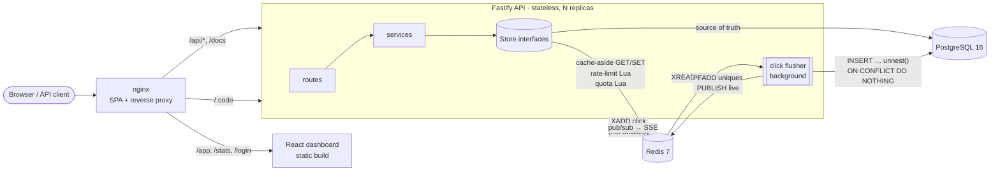

Every storage concern sits behind an interface in [`api/src/stores/types.ts`](api/src/stores/types.ts): `Store` (source of truth), `Cache`, `RateLimiter`, `ClickQueue`, `UniqueCounter`, `QuotaCounter` and `EventBus`. There are two implementations:

| | Local / tests | Production (docker compose, CI) |
| --- | --- | --- |
| Store | `MemoryStore` (Maps, same unique/cascade/idempotency rules) | `PostgresStore` (SQL migrations, keyset pagination, `GROUPING SETS` aggregation) |
| Cache | TTL map | Redis `GET`/`SET EX` |
| Rate limiter | sliding window in memory | same math, atomic **Lua** script |
| Click queue | bounded in-process queue | **Redis Stream** + consumer group, `XAUTOCLAIM` for crashed consumers |
| Uniques | own **HyperLogLog** implementation (p=14) | Redis `PFADD`/`PFCOUNT` |
| Live events | EventEmitter | Redis pub/sub fanned out to SSE clients |

A shared **contract test suite** ([`test/contract/storeContract.ts`](api/test/contract/storeContract.ts)) runs against both, so the fake can't drift from the real thing.

### The redirect hot path

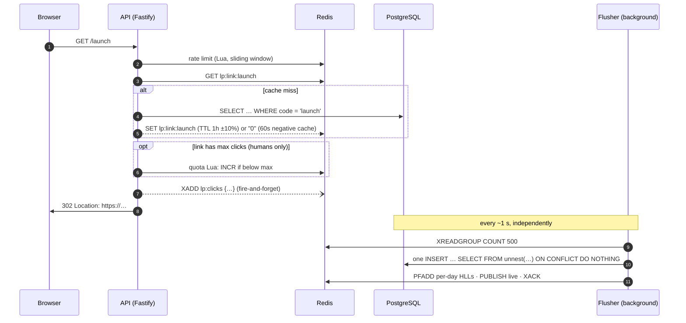

---

## System design

### Requirements and back-of-the-envelope numbers

Assume 100 M redirects/day and 1 M new links/day: a **100:1 read/write ratio**.

- Redirects: 100 M / 86 400 s ≈ **1 200 req/s average**, about 10–12 k/s at a 10× peak.
- Writes: ~12 links/s. Storage: ~500 B per link row gives ~180 GB over 1 B links, which fits one PostgreSQL primary with read replicas.
- Click events: 100 M/day at ~150 B ≈ 15 GB/day raw. That is why raw clicks get partitioned and rolled up (see [scaling](#scaling-notes)).
- Latency goal: redirects in single-digit milliseconds at p99, independent of analytics load.

### Read-heavy path: cache-aside

The redirect entry cached in Redis is small (`id, url, flags, expiresAt, maxClicks`) and never contains the password hash.

- **TTL with ±10 % jitter**, so keys written together don't expire together (thundering herd).
- **Negative caching**: unknown codes are cached as `"0"` for 60 s, so scanners hitting random codes cost one Redis GET, not one SQL query each.
- **Invalidate on write**: update, disable, delete and create all *delete* the key. Delete, not update, so a racing reader can't write stale data back for long. Creating an alias also clears it, in case someone hit that alias and got a 404 before it existed. Tested.
- **Cache down → degrade to the database** instead of failing redirects. The rate limiter **fails open** for the same reason.
- The expiry check runs on every request against the cached `expiresAt`, so a link expires on time even while its entry is cached.

### Async analytics

Recording a click must never slow the redirect, and the analytics database must never be hit once per click.

1. The redirect handler builds a small event: a UUID, link, timestamp, the HMAC visitor hash, raw UA, referrer and country. It `XADD`s the event **without awaiting** it. User-agent parsing is comparatively expensive, so it happens later.
2. A flusher (any API instance, via a **consumer group**) reads up to 500 events at a time. It parses user agents (with a small memo cache), normalises referrers, and writes the batch with **one** `INSERT … SELECT FROM unnest(...)` that also bumps `links.click_count`.
3. Delivery is **at-least-once**: entries stay pending until `XACK`, and entries a crashed consumer left behind are reclaimed with `XAUTOCLAIM`. The click UUID is the primary key and the insert uses `ON CONFLICT DO NOTHING`, so **redelivery is idempotent**. The counter only counts rows that were actually inserted. Tested.
4. A poison row (e.g. its link was deleted mid-flight) triggers a row-by-row retry instead of blocking the batch forever. If *nothing* can be written, the batch is not acked, so Redis keeps it until the database is back.
5. Analytics are eventually consistent within roughly one flush interval (1 s). The dashboard's "Live" pill is pushed over SSE after each flush.
6. In the in-memory backend the queue is bounded (100 k). Under overload it drops the oldest events and counts them, rather than slowing redirects or running out of memory.

**Max clicks** is a correctness rule, not analytics, so it is enforced **synchronously and atomically**. A Lua script increments `lp:quota:{id}` only if it is still below the maximum, seeding a cold key from the persisted count with `SET NX`. A test fires 6 concurrent visits at a `maxClicks: 3` link and exactly 3 get through. Bots are redirected but never consume the quota, so a Slack unfurl can't burn a one-time link.

### HyperLogLog for unique visitors

Exact distinct counting needs memory proportional to the number of visitors. A HyperLogLog needs **12–16 KB per counter no matter how many visitors it sees**, at a standard error of 0.81 % (p = 14).

- The flusher `PFADD`s the visitor hash into **one HLL per link per UTC day**, plus one per account per day.
- Unique visitors for any date range = `PFCOUNT key_day1 key_day2 …`. Redis merges the registers on the fly, so there are no precomputed ranges and no double counting across days. The trade-off: uniques are day-granular.
- Keys use Redis Cluster **hash tags** (`lp:uniq:{L123}:20260923`), so all days of one link live in one slot and a multi-key `PFCOUNT` stays legal on a cluster.
- The in-memory backend uses [my own HyperLogLog](api/src/lib/hyperloglog.ts) (MD5-based 64-bit hash, linear-counting small-range correction). The tests check < 2 % error at 200 k distinct items and that merge equals union.
- Uniques are capped at the click count, because an estimate may overshoot tiny exact counts.

### Rate limiting

**Sliding window counter**, the approach Cloudflare popularised:

```
estimate = previous_window_count × (1 − elapsed / window) + current_window_count
```

| | Memory per key | Boundary burst | Notes |
| --- | --- | --- | --- |
| Fixed window | O(1) | **up to 2×** at window edges | simplest |
| Sliding log | O(limit) | none | stores every timestamp |
| Token bucket | O(1) | allows configured bursts | great for smoothing, needs refill math |
| **Sliding window counter** (used) | **O(1)** | none (weighted) | ~exact, trivially atomic |

- In production the read-decide-increment runs in **one Lua script**. It is atomic across all API instances, and both keys share a hash tag so it is cluster-safe. Blocked requests don't count.
- The math lives in one pure module ([`slidingWindow.ts`](api/src/lib/slidingWindow.ts)) shared by both limiters. **`Retry-After` is computed exactly**: it is the moment the decaying estimate first leaves room for one more request. The unit tests assert that a request at `now + retryAfter` is allowed and one 50 ms earlier is not.
- Policies, all configurable by env:

  | Policy | Default |
  | --- | --- |
  | redirects | 300/min per IP |
  | sign-up/login | 10/min per IP (brute force) |
  | link creation | 60/min per IP **and** 30/min per user or API key |
  | password unlocks | 10/min per IP per link |
  | general API | 600/min per principal |

- Responses carry `RateLimit-Limit`, `RateLimit-Remaining`, `RateLimit-Reset` and `RateLimit-Policy`, plus `Retry-After` on 429. The dashboard turns that into the countdown banner in the screenshot above.

### ID generation trade-offs

| Approach | Collisions | Coordination | Code length | Guessable? |
| --- | --- | --- | --- | --- |
| Random 7-char + retry on conflict | birthday problem: retries grow as the table fills | a DB round trip per attempt | 7 | no |
| Hash of URL (MD5 → base62, truncated) | collisions after truncation, same URL → same code | none | 7 | no |
| Auto-increment + base62 | none | DB sequence per link | grows (1, 2, … chars) | **yes: enumerable** |
| Snowflake (time + worker + seq) | none | worker ids | 11 chars for 64 bits | partly (time-ordered) |
| **Leased counter + keyed Feistel permutation (used)** | **none, by construction** | one `nextval()` per **1 000** links | **always 7** | no (obfuscated) |

How it works ([`codeGenerator.ts`](api/src/lib/codeGenerator.ts), [`feistel.ts`](api/src/lib/feistel.ts)):

1. Each API instance **leases a block of 1 000 ids** from a PostgreSQL sequence (`nextval` = block number). Instances never overlap, and the database sees one call per 1 000 links. Concurrent callers share one in-flight lease (tested).
2. The id goes through a **4-round Feistel network** over 42 bits, keyed by `CODE_SECRET`. "Cycle walking" restricts it to exactly [0, 62⁷). A Feistel network is a bijection for any round function, so **two ids can never map to the same code**. The tests check this exhaustively on a 62³ domain.
3. The result is base62-encoded and left-padded to **7 characters**: 62⁷ ≈ 3.5 trillion codes.

The one remaining collision is with a user's 7-character custom alias. The unique index catches it and the service takes the next id; a test deliberately squats on the next code to cover it. This is obfuscation, not secrecy: private links should use a password.

### Security notes

- Passwords (accounts and links) use **Argon2id** at the OWASP baseline: 19 MiB, t=2. Unknown-email logins still run a dummy hash, so response times don't reveal which emails have accounts.
- API keys have 190 bits of entropy, so a single SHA-256 is enough and allows an indexed lookup. A slow KDF would only add latency.
- Visitor identity = `HMAC(salt, ip ‖ ua)`. IPs never reach the queue, the database or the CSV export (tested).
- SSRF: see the preview fetcher above. The "private address" check covers v4, v6 and IPv4-mapped v6, and runs on the resolved IP at connect time.

### Scaling notes

- **API**: stateless, so it scales horizontally behind a load balancer. `/ready` flips to 503 on SIGTERM so the balancer drains an instance before it exits.
- **Redis**: the hot path costs 1 GET + 1 Lua call (+1 for max-clicks links) + 1 XADD. ioredis *auto-pipelining* batches concurrent commands into fewer round trips. All multi-key operations use hash tags, so moving to Redis Cluster needs no code change.
- **Hottest links**: add a tiny in-process LRU (L1) in front of Redis for the top links. Or, for 301-able links, let a CDN cache the redirect at the edge, at the cost of losing those clicks from analytics.
- **PostgreSQL**: redirects only touch it on cache misses, so read replicas absorb them. Beyond a single writer, shard links by code (hash of the code → shard); nothing in the design joins across links.
- **Click data**: partition `clicks` by month (drop old partitions instead of `DELETE`) and maintain hourly **rollup** tables so dashboards read pre-aggregated rows. At bigger scale, the flusher writes to a columnar store (ClickHouse/BigQuery) instead; the stream consumer is the only thing that changes.
- **Multi-region**: codes are region-independent (the leased-block scheme works with one global sequence or per-region block ranges), and read-your-writes only matters for the link owner.

---

## Quick start

### Option A: no Docker (in-memory backend, demo data)

Requirements: Node 20+ (tested on 22).

```bash
npm run setup      # npm ci in api/ and web/
npm run dev        # API :3501 (seeds demo data) + dashboard :3502
```

- Dashboard: http://localhost:3502, log in with **`demo@linkpulse.dev` / `demo-password-123`** (fictional data).
- API docs: http://localhost:3501/docs
- Try a redirect: http://localhost:3501/launch
- Demo traffic: a few synthetic clicks per second flow through the real queue → flusher → SSE path, so the Live pill moves. Turn it off with `DEMO_TRAFFIC=false`.

### Option B: full stack (PostgreSQL + Redis + nginx)

```bash
docker compose up --build        # → http://localhost:8080
```

This runs PostgreSQL 16, Redis 7 (AOF, `noeviction`), the API (migrations run on start, demo data seeded once), and nginx. nginx serves the dashboard and proxies `/api`, `/docs` and every short code to the API.

> **Honesty note:** Docker isn't installed on the machine this was built on, so I have **not** run `docker compose up` myself. What *is* verified is in [CI](.github/workflows/ci.yml): both images are built with `docker compose build`, the full test suite runs against PostgreSQL 16 + Redis 7 service containers, and the compiled server is booted on PostgreSQL + Redis and smoke-tested, including graceful shutdown on SIGTERM. I also ran the PostgreSQL store contract and all app-level tests locally against a real PostgreSQL 16 (embedded binaries).

### Configuration

Every setting has a dev default; see [`api/.env.example`](api/.env.example). The important ones:

| Variable | Default | Meaning |
| --- | --- | --- |
| `STORE` | `memory` | `memory` or `postgres` (then `DATABASE_URL` + `REDIS_URL` are used) |
| `PUBLIC_BASE_URL` | `http://localhost:3501` | origin used in `shortUrl`, and blocked as a destination (loops) |
| `JWT_SECRET`, `CODE_SECRET`, `VISITOR_SALT` | dev values | **must** be set in production (the server refuses a dev JWT secret in production) |
| `REDIRECT_STATUS` | `302` | or `301` |
| `COUNTRY_HEADER` | `cf-ipcountry` | header holding an ISO-3166 alpha-2 country (`X-Country` is also read) |
| `TRUST_PROXY` | `false` | set `true` behind nginx/a load balancer so rate limits see client IPs |
| `RL_*_LIMIT` / `RL_*_WINDOW_MS` | see above | rate-limit policies (`RATE_LIMITS_ENABLED=false` turns them off) |
| `BLOCKED_DOMAINS` | – | comma-separated extra blocklist |

---

## API overview

Full, interactive reference: **`/docs`** (OpenAPI 3, generated from the same TypeBox schemas that validate requests and serialise responses).

| Method | Path | |
| --- | --- | --- |
| `GET` | `/:code` | Redirect (302/301), 404, 410, password form, 429 |
| `POST` | `/:code` | Unlock a password-protected link (303 on success) |
| `POST` | `/api/auth/signup` · `/login` · `/logout` | Session cookie auth |
| `GET` | `/api/auth/me` | Current user |
| `GET` `POST` | `/api/links` | List (search, keyset cursor) · create |
| `GET` `PATCH` `DELETE` | `/api/links/:id` | Read · update (`null` clears expiry/max/password) · delete |
| `GET` | `/api/links/:id/qr.svg?format=png&size=512` | QR code |
| `GET` | `/api/links/:id/analytics?from&to&bucket=hour\|day` | Aggregates |
| `GET` | `/api/links/:id/analytics.csv` | Raw click export |
| `GET` | `/api/links/:id/events` | Live clicks (SSE) |
| `GET` | `/api/overview?days=30` | Account dashboard summary |
| `GET` | `/api/public/stats/:code` | Public stats (opt-in) |
| `GET` `POST` `DELETE` | `/api/keys` | API key management |
| `GET` | `/health` · `/ready` | Liveness · readiness |

```bash
# Create a link with an API key
curl -X POST http://localhost:3501/api/links \
  -H "Authorization: Bearer lp_live_…" -H "Content-Type: application/json" \
  -d '{"url":"https://example.com/launch","alias":"spring-launch","maxClicks":500}'
```

Errors always have the shape `{ "error": { "code": "alias_taken", "message": "…" } }`.

---

## Tests

```bash
npm test                              # API + web
cd api && npm run test:integration    # same suite on real PostgreSQL + Redis (needs DATABASE_URL/REDIS_URL)
```

**API: 107 tests** (Vitest) run locally against the in-memory backend. 7 more (the PostgreSQL + Redis store contract) are skipped locally and run in CI.

| Area | What is covered |
| --- | --- |
| Code generator | base62 alphabet + round-trip, Feistel bijection (exhaustive over 62³), 100 k unique 7-char codes, block leasing under concurrency, two instances sharing a sequence, alias collision skip |
| URL safety / SSRF | dangerous schemes, private/loopback/link-local/metadata IPs incl. decimal/hex/octal/IPv6-mapped forms, credentials, self-links, blocklist, reserved aliases, DNS-rebinding guard in the socket lookup, preview extraction |
| Rate limiter | sliding-window weighting, exact `Retry-After` in both cases, no boundary burst, 429 + headers over HTTP per IP / per login / per API key, HTML 429 page |
| Redirect flow | 302/301, cache MISS→HIT, negative caching + alias creation, invalidation on edit, disabled/expired (clock-controlled)/max-clicks (concurrent)/bots-don't-consume, password form/401/303, delete → 404 |
| Analytics | batching, idempotent redelivery, UA/referrer/country enrichment, hour/day buckets with zero-fill, HLL uniques, overview/top links, CSV escaping (formula injection), ranges, public stats opt-in, SSE fan-out |
| Auth & isolation | signup/login/logout, cookie flags, forged JWT, CSRF header, other users' links → 404 on every route, cursor pagination, API keys hashed at rest / Bearer usage / revocation / owner scoping |
| Ops | `/health`, `/ready` (503 while draining), OpenAPI document, graceful close drains the queue |
| **Store contract** | the same 7 behavioural tests on the memory backend and on PostgreSQL + Redis |

**Web: 32 tests** (Vitest + Testing Library): API client (429 parsing, CSRF header, errors), formatting and validation helpers, date ranges, create form (field errors, 409 alias, 429 banner + countdown), link table + keyboard menu, analytics view.

**CI** ([`.github/workflows/ci.yml`](.github/workflows/ci.yml)) has four jobs:
1. API typecheck + tests + build.
2. The whole API suite again with `LP_TEST_BACKEND=real` against **PostgreSQL 16 and Redis 7 service containers**, then a boot-and-smoke test of the compiled server on those backends.
3. Web typecheck + tests + build.
4. `docker compose build`.

## Load test

`npm run loadtest` starts the API in its own process with the **in-memory backend**, warms up for 2 s, then runs [autocannon](https://github.com/mcollina/autocannon) for **10 s per scenario** with 50 connections. The analytics flusher runs inside the server, so every redirect also pays for queueing and batched persistence.

Representative run on my dev machine (Windows 10, Node 22, Intel i5-7400 4-core, shared with other work):

| Scenario | req/s | p50 | p99 | Requests | Result |
| --- | ---: | ---: | ---: | ---: | --- |
| 302 redirect, cache hit | 8 407 | 4 ms | 30 ms | 84 071 | 84 071 × 302, **all 84 121 clicks persisted** (incl. warm-up tail) |
| 404 unknown code, negative cache | 9 448 | 4 ms | 21 ms | 103 919 | 103 919 × 404 |
| 429 one IP over its limit | 11 500 | 4 ms | 8 ms | 126 491 | 126 491 × 429 |

Treat these as **local, in-memory, single-process** numbers. They show the application code path is cheap and that shedding load with 429s is cheaper than serving it. They don't include Redis or network latency. The machine was busy with other work, and repeated runs varied by up to ~3× (cached 302s ranged 3.5–9.3 k req/s). Zero errors or timeouts in every run.

---

## Project structure

```
linkpulse/
├── api/                          Fastify + TypeScript (strict, ESM)
│   ├── src/
│   │   ├── app.ts                wiring: stores → services → routes, plugins, error handling
│   │   ├── server.ts             entry: config, seeding, listen, graceful shutdown
│   │   ├── config.ts             typed env config with dev defaults
│   │   ├── domain/               records + typed errors
│   │   ├── lib/                  base62, Feistel, code generator, HyperLogLog, sliding window,
│   │   │                         URL safety, SSRF-safe fetch, UA parsing, crypto, time buckets
│   │   ├── services/             link, redirect, analytics, click pipeline, auth, preview
│   │   ├── stores/               interfaces + memory/, redis/, postgres/ (+ SQL migrations)
│   │   ├── http/                 schemas (TypeBox → OpenAPI), rate-limit hook, HTML pages
│   │   ├── routes/               auth, keys, links (+ analytics, QR, SSE), public (redirects), health
│   │   └── seed/                 deterministic fictional demo data
│   ├── test/                     unit/, integration/ (app.inject), contract/ (store contract)
│   └── bench/                    autocannon load test
├── web/                          React 18 + TypeScript + Vite dashboard (recharts, qrcode)
│   ├── src/{api,components,hooks,lib,pages,styles,test}
│   ├── Dockerfile · nginx.conf   static build served by nginx, API/short links proxied
├── docker-compose.yml            postgres + redis + api + web
├── .github/workflows/ci.yml
└── docs/screenshots/
```

## Stack

- **API**: Node 22, TypeScript (strict), Fastify 5, TypeBox (validation + serialisation + OpenAPI), @fastify/swagger(-ui), @fastify/jwt + cookie, ioredis, node-postgres, @node-rs/argon2, ua-parser-js, isbot, qrcode, pino.
- **Data**: PostgreSQL 16 (plain SQL migrations with an advisory-locked runner), Redis 7 (cache, Lua rate limiter and quota, Streams, HyperLogLog, pub/sub).
- **Web**: React 18, React Router, Recharts, qrcode (client-side), hand-written CSS with design tokens (light/dark, responsive to 390 px, keyboard-accessible dialogs and menus, reduced-motion aware).
- **Tooling**: Vitest, Testing Library, autocannon, GitHub Actions, Docker + nginx.

## License

© 2026 Hamza Ben Ismail. All rights reserved.
